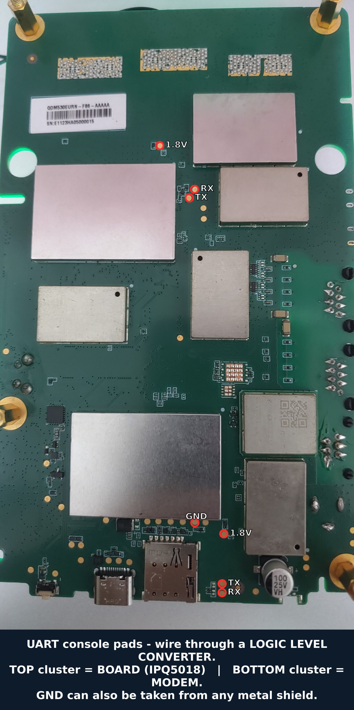

# QDM530 — getting into the UART console

The serial console (`ttyMSM0`, **115200 8N1**) is the prerequisite for the UART/TFTP
first-flash and for any recovery (see `build-and-flash.md` §4a). There are two ways in.

## A. Front RJ12 port + RJ12-to-USB console cable (easiest)

The front **RJ12 6P6C** port breaks out the IPQ5018 console UART; a RJ12-to-USB console
cable with a built-in USB-serial chip links it to a PC.

> **The RJ12 pinout of this board has NOT been characterized.** The specific cable we used
> happened to work plug-and-play, but **RJ12 is only a connector — which signal sits on
> which pin is not standardized**, so a *different* RJ12-to-USB cable may be wired
> differently and simply not work (or mis-connect). Having a CP2102/FTDI inside does **not**
> guarantee a matching pinout. So: use the same cable known to work, or map the pinout
> yourself first (route B / the photo). To map it, identify GND, the board's TX (the pin
> that is active while the board prints at power-on) and RX, then match your cable.

Plug the cable into the front RJ12 port and the PC, then open a terminal:

```sh
picocom -b 115200 /dev/ttyUSB0        # or:  screen /dev/ttyUSB0 115200
# or:  minicom -D /dev/ttyUSB0 -b 115200
```

Find the right node with `dmesg | tail` right after plugging the cable in (it usually
appears as `/dev/ttyUSB0`).

**Shortcut:** `tools/uart-console.sh` auto-detects the serial node and opens the console
(picocom / screen / minicom, whichever you have).

## B. Bare USB-TTL adapter or microcontroller (DIY, onto the console pads)

If you don't have the matching cable, wire a USB-TTL adapter (or an MCU bridging UART↔USB)
straight to the console pads.

**Pad locations — see the photo.** The **top** cluster of marked pads is the **BOARD
(IPQ5018)** console; the **bottom** cluster is the **MODEM** console (a separate UART on the
same board). Connect **TX / RX / GND** as marked (skip the power pad), through a logic-level
converter — and **GND can also be taken from any metal shield**.



Wiring — three wires, cross-over:

- adapter **RX** ← board **TX**
- adapter **TX** → board **RX**
- **GND ↔ GND** (common ground, required)
- leave any VCC/power pad **unconnected** — the console needs only TX / RX / GND.

> **Put a logic-level converter between your adapter and the board.** The board's console
> UART and a typical USB-TTL adapter may run at **different logic levels**; driving the
> board's RX directly from a higher-level adapter can be unreliable or stress the pin, so
> use a level converter in between (or an adapter that already matches the board's level).
> Route A's RJ12 port path handles this on-board; the raw pads do not.

Then open the terminal the same way (`picocom -b 115200 ...`).

## Catching U-Boot

U-Boot stops at a password prompt (`passwd_abort`). With the terminal open, **power the
board on and repeatedly send `quectel` + Enter** ("flood" it) — that reliably catches the
prompt and drops you into the U-Boot shell. From there follow `build-and-flash.md` §4a for
the TFTP RAM-boot (`tools/tftp-recovery-setup.sh`).

**Automated:** `tools/uart-console.sh -c` floods `quectel` for you and keeps retrying on
every reset — useful for a **bootlooping** board. Power-cycle it with the flood running,
then press Enter once the U-Boot prompt (`=>` / `#`) appears to go interactive.
